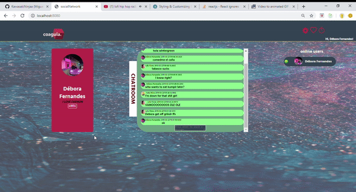
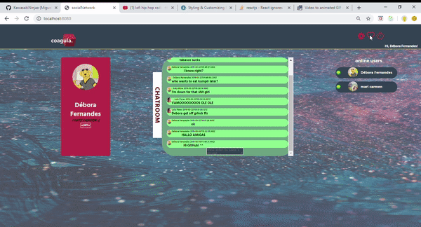
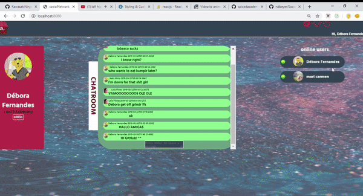

# COAGULA- a social network

This project is part of my work for the Full-Stack Web Development program at SPICED Academy in Berlin.

Coagula is a social network in a single-page application format. 

## Stack

* React, ReactRouter & Redux 
* AWS S3 
* Express
* PostgreSQL
* Sockets

## Features

### Login / SignUp

### ProfilePic- upload with AWS S3

### Bio

### Friendships

### Chatroom

### Online Users

